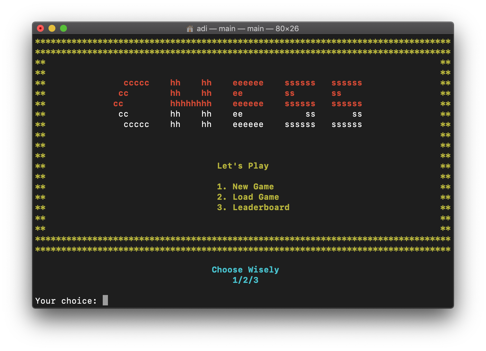

# catur
Game catur menggunakan bahasa C

Cara kompilasi:
1. Buka terminal
2. Masuk ke direktori catur/ProgramUtama
3. Compile file main.c dengan menulis `gcc -o main main.c`
4. Jalankan program dengan menuliskan `main` atau `./main`
5. Program siap dijalankan

Tambahan: 
Untuk pengguna Windows, ganti seluruh kode 'system('clear')' menjadi 'system('cls')' untuk dapat menghapus tampilan sebelumnya agar program terlihat lebih rapi. Kode ini dapat dijumpai pada file start.c  
Program ini menggunakan prosedur delay() yang memberikan jeda satu detik setiap saat pemain selesai melakukan gerakan. Delay dapat dinonaktifkan dengan menghapus/menjadikan komentar kode delay() di file main.c dan start.c

Screenshot: 

